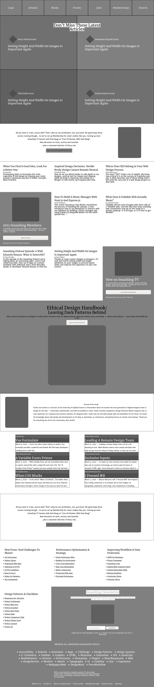

# Design teardown - The Odin Project

This project consists of building a heatmap of the Smashing magazine website. [Original version](https://www.smashingmagazine.com/)

In this simple project, we breaking apart the website for a popular design magazine with which you’re probably familiar by now – Smashing Magazine.

The goal for this exercise is to start training to think in terms of visual hierarchy, typography and design principles.

The job is to create a grayscale heat map of the website that indicates which elements have the greatest weight in the visual hierarchy.

## Built With

- HTML & CSS
- Flexbox & Float

## Live Demo

[Live Demo Link](http://htmlpreview.github.io/?https://github.com/duducus/DesignAandUX/blob/feature/index.html)

## Authors

👤 **Author1**

- Github: [@duducus](https://github.com/duducus)
- Twitter: [@jorgeceron](https://twitter.com/jorgeceron1)
- Linkedin: [linkedin](https://mx.linkedin.com/in/jorge-francisco-cer%C3%B3n-gil-343583113)

👤 **Marcos Hernández Campos**

- Github: [@marcoshdezcam](https://github.com/marcoshdezcam)
- Twitter: [@MarcosHCampos](https://twitter.com/MarcosHCampos)
- Linkedin: [Marcos Hernández](https://linkedin.com/marcos-hernández-56058119a/)

## 🤝 Contributing

Contributions, issues and feature requests are welcome!

Feel free to check the [issues page](issues/).

## Show your support

Give a ⭐️ if you like this project!

## Acknowledgments

- Hat tip to anyone whose code was used
- Inspiration
- etc

## 📝 License

This project doesn't require a license.
